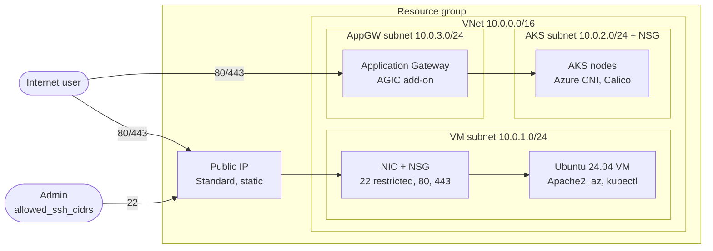

# Azure VM + AKS Provisioning (Terraform)

Terraform configuration that provisions, in a single resource group on Azure:

- a **hardened Ubuntu 24.04 VM** (SSH-key only, NSG-restricted) that serves a static landing page with Apache2 and comes with Azure CLI, kubectl and git preinstalled;
- an **AKS cluster** (Azure CNI + Calico) placed in its own subnet, with an optional **Application Gateway Ingress Controller**;
- the **virtual network, subnets, NSGs and public IP** that connect them.

The repository also contains a small static [portfolio website template](Portfolio-website-templates/) that can be hosted on the VM.

> **Status:** the configuration passes `terraform fmt` and `terraform validate` locally (a GitHub Actions workflow runs the same checks), but it has not been applied against a live subscription. Review `terraform plan` before every `apply`.

## Architecture



Details and design decisions: [docs/architecture.md](docs/architecture.md).

## Repository layout

```
.
├── main.tf                     # Root module: resource group + module wiring
├── variables.tf                # Root inputs (with validation)
├── outputs.tf                  # VM IP, SSH command, AKS name/id
├── providers.tf                # Terraform / azurerm version constraints
├── terraform.tfvars.example    # Copy to terraform.tfvars
├── backend.tf.example          # Optional remote state (Azure Storage)
├── .terraform.lock.hcl         # Pinned provider versions (commit this)
├── modules/
│   ├── network/                # VNet, subnets, NSGs, public IP, NIC
│   ├── compute/                # Linux VM + provision.sh (cloud-init)
│   └── aks/                    # AKS cluster (+ optional AGIC)
├── Portfolio-website-templates/# Static site template (HTML/CSS/JS)
├── docs/architecture.md        # Design notes and decisions
└── .github/workflows/          # CI: fmt, validate, shellcheck
```

## Prerequisites

- An Azure subscription where you can create resources (Contributor on the subscription or resource group).
- [Terraform](https://developer.hashicorp.com/terraform/install) `>= 1.5`
- [Azure CLI](https://learn.microsoft.com/cli/azure/install-azure-cli), signed in with `az login`
- An SSH key pair (`ssh-keygen -t ed25519`) — only the **public** key is read

## Quick start

```bash
git clone https://github.com/Gurmeta/AZ-VM-provisioning-and-website-hosting.git
cd AZ-VM-provisioning-and-website-hosting

az login
az account set --subscription "<subscription-id>"

cp terraform.tfvars.example terraform.tfvars   # edit: allowed_ssh_cidrs is REQUIRED
terraform init
terraform plan -out tfplan
terraform apply tfplan
```

After the apply:

```bash
terraform output ssh_command                       # connect to the VM
az aks get-credentials \
  -g "$(terraform output -raw resource_group_name)" \
  -n "$(terraform output -raw aks_cluster_name)"   # configure kubectl
```

The landing page is served at `http://<vm_public_ip>/` once cloud-init finishes (a few minutes after the VM is up).

Tear everything down with `terraform destroy`.

## Configuration

All inputs live in [variables.tf](variables.tf). The most important ones:

| Variable | Default | Description |
| --- | --- | --- |
| `allowed_ssh_cidrs` | *(required)* | CIDRs allowed to SSH to the VM. `0.0.0.0/0` is rejected. |
| `location` | `westeurope` | Azure region. |
| `name_prefix` / `environment` | `gbs` / `dev` | Used to name every resource and in tags. |
| `ssh_public_key_path` | `~/.ssh/id_rsa.pub` | Public key installed on the VM. |
| `admin_username` | `azureuser` | VM admin user (no password login). |
| `vm_size` / `node_vm_size` | `Standard_B2s` / `Standard_D2s_v3` | VM and AKS node sizes. |
| `node_count` | `2` | AKS node count. |
| `enable_agic` | `true` | Create an Application Gateway + AGIC add-on (billed hourly). |
| `aks_allowed_inbound_ports` | `[80, 443]` | Ports opened on the AKS subnet NSG. |

## Security notes

- **No secrets in the repo.** There is no password: the VM accepts SSH keys only. `*.tfvars`, state files and keys are git-ignored.
- **SSH is never open to the internet.** You must supply your own CIDR(s).
- **NSGs are actually attached** (NIC for the VM, subnet for AKS). HTTP/HTTPS are public by design for the website; add other ports (e.g. 3000 for Grafana) only deliberately.
- **State** may contain sensitive values. For anything beyond experiments, use a remote backend with access control — see [backend.tf.example](backend.tf.example).
- **Provisioning script** installs tools from signed apt repositories (Microsoft, Kubernetes) instead of `curl | bash`.
- With a system-assigned identity and a custom VNet, AKS may need the *Network Contributor* role on the AKS subnet to create load balancers; grant it if a Service of type `LoadBalancer` stays pending.

## Cost awareness

Running resources are billed: the VM, the AKS nodes, the Standard public IP and — if `enable_agic = true` — an Application Gateway v2 (the largest line item). Set `enable_agic = false` for cheaper experiments and run `terraform destroy` when done.

## Development

```bash
terraform fmt -recursive
terraform init -backend=false
terraform validate
shellcheck modules/compute/provision.sh
```

The same checks run in GitHub Actions on every push and pull request.

## Portfolio website template

[Portfolio-website-templates/](Portfolio-website-templates/) is a static page that lists your public GitHub repositories. Set `GITHUB_USERNAME` in `fetching-github-profile.js` and your links in the HTML, then copy the three files to `/var/www/html/` on the VM. The contact form is a placeholder and must be connected to a backend or form service before real use.

## Changes from the first version

- Added the missing `variables.tf` (it was git-ignored, so the project could not run) and per-module variables and outputs.
- Removed password authentication and the unused `ssh` module / extra resource group.
- Attached the VM NSG to the NIC and restricted SSH; switched the public IP to the Standard SKU.
- Replaced unsafe `provision.sh` steps with signed apt repositories and strict shell mode.
- Gave Application Gateway its own subnet; removed the unused AKS public IP and the commented-out code.
- Added input validation, consistent naming and tags, a lock file, CI, and this documentation.

## License

Apache-2.0 — see [LICENSE](LICENSE).
